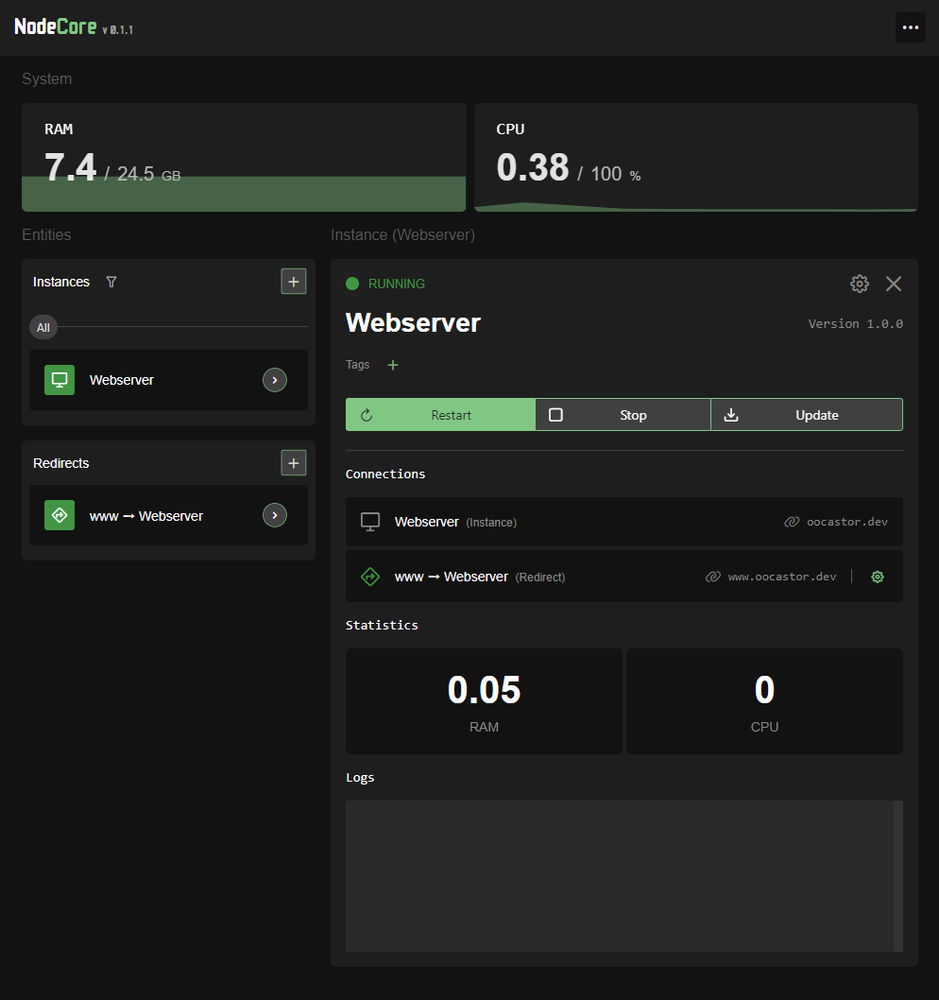

# NodeCore

NodeCore is a simple and minimalistic Node.js Deployment System that handles the download, setup, and integration of your Node instances.



### Features:
- GitHub Integration (pull your projects directly from your online repo)
- PM2 Integration (used to run the Node.js instances, handles process management)
- Integrated Proxy (add your domains and proxy requests directly to your Node server)
- Automatic SSL Certificates from Let's Encrypt (any proxy endpoint is automatically secured via SSL)

### Planned Features:
- SQL and MongoDB Management Page
- Telegram Notifications
- Project Upload via file system and local Git server

## Requirements
- Node.js (Version 18.x) installed
- PM2 installed

## Installation

1. Download project
    ```bash
    git clone https://github.com/oocastor/NodeCore
    ```

2. Change Directory
    ```bash
    cd NodeCore
    ```

3. Install Project
    ```bash
    npm i
    ```

4. Start ``NodeCore`` with pm2
    ```bash
    pm2 start app.js -- --color && pm2 save
    ```

## First Steps

- Open a browser and go to ``https://<your_ip>:1001`` (make sure you are using HTTPS!)
<br><br>
- Login with the following credentials
    - Username: ``nodecore``
    - Password: ``nodecore``
<br><br>
- Go to the "Settings" page:
    - Change your login credentials.
    - Add a GitHub PAT.
    - Add a domain that points to the server.
    - Enable the proxy and set your email.
    - Activate a redirect from your domain to port 1001 (use @ as subdomain)